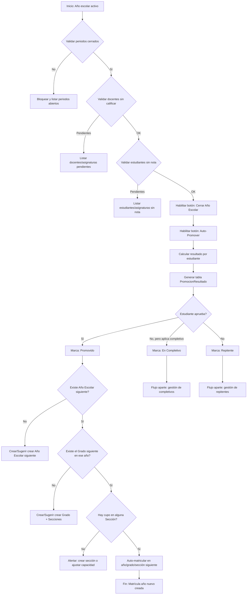

# Flujo de Cierre de Año Escolar y Auto-Promoción de Estudiantes

## 1. Objetivo

Diseñar un flujo confiable y auditable que permita:

1. Validar que el año escolar puede cerrarse (periodos cerrados, sin docentes pendientes de calificar, sin estudiantes sin nota).
2. Ejecutar una **auto-promoción** que determine automáticamente quién aprueba, quién reprueba y quién queda en completivo/recuperación.
3. Matricular automáticamente a los promovidos en el año escolar siguiente, verificando (o creando) la estructura de Año → Grado → Sección necesaria.
4. Mantener separado el flujo de los que **no** fueron promovidos directamente.
5. Tener un control claro entre el "listado maestro de estudiantes" (histórico, de por vida) y el "listado de matriculados" (por año/grado/sección, que cambia cada ciclo).

---

## 2. Modelo de datos base (entidades clave)

Esto asume una estructura relacional típica. Ajusta nombres a tu esquema real.

| Entidad | Descripción | Campos clave |
|---|---|---|
| `Estudiante` | Registro único y permanente de la persona (no cambia año a año) | id, nombre, documento_identidad, fecha_nacimiento, estado_general (activo/inactivo/egresado) |
| `AñoEscolar` | Ciclo lectivo (ej. 2025-2026) | id, nombre, fecha_inicio, fecha_fin, estado (planificado / activo / cerrado) |
| `Grado` | Nivel académico (1ro, 2do, ... Bachillerato) | id, nombre, orden_secuencial (para saber a qué grado se promueve) |
| `Seccion` | División dentro de un grado en un año (A, B, C) | id, grado_id, año_escolar_id, capacidad_max |
| `Periodo` | Corte de calificación (bimestre, trimestre) dentro de un año escolar | id, año_escolar_id, nombre, estado (abierto/cerrado), orden |
| `Matricula` | **Relación** estudiante–año–grado–sección (esto es lo que cambia cada año) | id, estudiante_id, año_escolar_id, grado_id, seccion_id, estado (activa/retirada/promovida/repitente/en_completivo) |
| `Asignatura` | Materia dentro de un grado | id, grado_id, nombre |
| `AsignaturaDocente` | Asignación de docente a una asignatura/sección | id, docente_id, asignatura_id, seccion_id, periodo_id |
| `Calificacion` | Nota de un estudiante en una asignatura y periodo | id, matricula_id, asignatura_id, periodo_id, nota |
| `PromocionResultado` | Tabla nueva propuesta (ver sección 5) | ver abajo |

**Punto crítico de diseño:** `Estudiante` es el listado maestro (vive para siempre). `Matricula` es el listado operativo por año/grado/sección. Todo el flujo de promoción trabaja sobre `Matricula`, nunca modifica directamente al `Estudiante`, salvo su estado general (activo/egresado/retirado).

---

## 3. Validaciones previas al cierre de año escolar

Antes de habilitar el botón "Cerrar Año Escolar", el sistema debe correr una validación en 3 capas. Si alguna falla, el cierre queda bloqueado y se muestra un reporte de pendientes (no solo un error genérico).

### 3.1 Validación de periodos
- Todos los `Periodo` del `AñoEscolar` deben tener `estado = cerrado`.
- Si un periodo está abierto, listar cuál y bloquear.

### 3.2 Validación de docentes sin calificar
- Por cada `AsignaturaDocente` activa, verificar que exista al menos una `Calificacion` cargada por cada estudiante matriculado en esa sección, para cada periodo.
- Generar un reporte: **Docente / Asignatura / Sección / Periodo / # estudiantes sin nota**.
- Regla de negocio a decidir contigo: ¿se bloquea el cierre, o se permite y se marca como incidencia para el coordinador académico? (Recomendado: bloquear, porque afecta el cálculo de promoción).

### 3.3 Validación de estudiantes sin calificación
- Por cada `Matricula` activa, por cada `Asignatura` de su grado, por cada `Periodo`, debe existir una `Calificacion`.
- Si no existe: dos caminos posibles (deben decidirlo académicamente, no solo técnicamente):
  - **Opción A (la que mencionas):** el sistema auto-genera la nota en 0 al momento del cierre, dejando trazabilidad de que fue "nota generada por sistema" (campo `origen = sistema` vs `origen = docente`).
  - **Opción B:** el cierre se bloquea hasta que el docente o coordinador registre manualmente la nota (aunque sea 0), para evitar que el sistema tome decisiones silenciosas.
  - Recomendación: usar **B por defecto**, con opción de "forzar cierre con ceros automáticos" solo para un rol superior (Dirección), dejando log de auditoría de qué se forzó y quién lo autorizó.

### 3.4 Resultado de la validación
Antes de mostrar el botón de auto-promover, mostrar un **panel de estado de cierre**:

```
✅ Periodos cerrados: 4/4
⚠️ Docentes con calificaciones pendientes: 2 (ver detalle)
⚠️ Estudiantes con notas faltantes: 7 (ver detalle)
[Botón Cerrar Año Escolar]  -> deshabilitado hasta resolver los ⚠️
```

---

## 4. Flujo general (visión completa)



---

## 5. Tabla de resultados de promoción (`PromocionResultado`)

Esta es la tabla intermedia que mencionas — el "cálculo antes de ejecutar". Debe ser **editable/revisable por Dirección antes de confirmar**, no un proceso ciego de un solo clic.

| Campo | Descripción |
|---|---|
| id | PK |
| año_escolar_id | Año que se está cerrando |
| estudiante_id | FK a Estudiante |
| matricula_actual_id | Matrícula que se está evaluando |
| promedio_general | Calculado según tu fórmula (promedio simple, ponderado, etc.) |
| materias_reprobadas | Cantidad y detalle (JSON o tabla relacionada) |
| resultado | `promovido` / `completivo` / `repitente` |
| grado_destino_id | A qué grado pasa (si promovido) — nulo si repite |
| año_escolar_destino_id | Año siguiente |
| seccion_sugerida_id | Sección sugerida en destino (puede reasignarse manualmente) |
| estado_matriculacion | `pendiente` / `matriculado` / `error` |
| revisado_por | Usuario que confirmó el resultado (auditoría) |
| fecha_calculo | timestamp |
| observaciones | Texto libre (ej. "pasa con 2 materias en recuperación") |

### Reglas de negocio a definir contigo (no técnicas, son de coordinación académica):
- ¿Cuál es la nota mínima de aprobación por asignatura y el promedio mínimo general?
- ¿Cuántas materias reprobadas mandan a completivo vs. directo a repetir?
- ¿El completivo se resuelve **antes** de matricular en el año siguiente, o el estudiante queda matriculado "condicional" mientras se resuelve?
- ¿Un estudiante puede repetir el mismo grado más de una vez (límite)?

Estas reglas deben vivir en una tabla de configuración (`ReglaPromocion`) parametrizable por grado/nivel, no quemadas en código, porque casi siempre cambian entre primaria/secundaria o por normativa del ministerio de educación.

---

## 6. Flujo de auto-matriculación al año siguiente

Cuando el resultado es `promovido`:

1. **Verificar existencia del Año Escolar siguiente.**
   - Si no existe → no auto-crear silenciosamente. Mostrar acción sugerida: "Crear Año Escolar 2026-2027" con fechas sugeridas (puede inferirse: fecha_fin actual + 1 día como inicio, etc.), pero que lo confirme un humano.
2. **Verificar existencia del Grado destino dentro de ese año.**
   - `grado_destino = grado_actual.orden_secuencial + 1`
   - Si no existe el grado en ese año (ej. es la primera vez que se abre el sistema para ese nivel) → sugerir crearlo con las mismas asignaturas base del grado (puede copiarse del plan curricular).
3. **Verificar Secciones y cupo.**
   - Si no hay secciones creadas → bloquear con mensaje claro, no crear secciones automáticamente sin criterio (esto normalmente lo decide un coordinador, por cantidad de alumnos, aulas, etc.).
   - Si hay secciones pero sin cupo → alertar, permitir crear nueva sección o ajustar capacidad manualmente.
4. **Crear la nueva `Matricula`:**
   - `estudiante_id` = mismo
   - `año_escolar_id` = año siguiente
   - `grado_id` = grado destino
   - `seccion_id` = sugerida o elegida
   - `estado` = `activa`
   - Se mantiene un vínculo `matricula_origen_id` apuntando a la matrícula del año anterior, para trazabilidad histórica del estudiante (esto es clave para reportes de "trayectoria del estudiante").
5. **Marcar la `Matricula` del año que cierra** como `estado = promovida` (no se borra, queda como historial).

Este mismo patrón de "verificar año → verificar grado → verificar sección → verificar cupo → matricular" es reutilizable también para matrícula manual normal, así que conviene construirlo como un **servicio único** (`ServicioMatriculacion`) que se llama tanto desde el flujo automático como desde el flujo manual de secretaría.

---

## 7. Flujo separado: reprobados y completivos

Correcto tu instinto de separarlo. Sugerencia concreta:

### 7.1 Repitentes directos
- `Matricula` nueva se crea en el **mismo grado**, año siguiente, con `estado = repitente` (para diferenciarlo de un estudiante nuevo o de un promovido normal en reportes).
- Debe poder aplicarse el mismo chequeo de cupo/sección.

### 7.2 Completivos / recuperación
Aquí hay dos sub-modelos posibles, y conviene que elijas uno según cómo trabaja tu colegio:

**Modelo A – "Matrícula condicional"**
- Se matricula ya en el grado siguiente con `estado = condicional`.
- Se abre un mini-proceso de "Examen de Completivo" con sus propias calificaciones.
- Si aprueba el completivo → `estado` pasa a `activa` normal.
- Si no aprueba → se revierte la matrícula: se anula la del grado siguiente y se crea una de repitente en el grado actual.

**Modelo B – "Resolución antes de matricular"**
- El estudiante **no se matricula** en el año siguiente hasta que se resuelva el completivo (que puede correr en un periodo de vacaciones, por ejemplo).
- Solo cuando se registra la nota del completivo y aprueba, se dispara el mismo servicio de auto-matriculación del punto 6.
- Es más lento pero evita el "deshacer matrícula", que suele ser más delicado (arrastra asistencia, notas parciales, etc. si ya empezó el año).

Mi recomendación honesta: **Modelo B** es más limpio operativamente, aunque menos "automático". El Modelo A es más rápido de implementar como flujo, pero genera más casos borde (¿qué pasa con las notas que ya sacó en el grado al que no debía haber entrado?).

---

## 8. Organización de listados (tu punto sobre control)

Para tener buen control, maneja **tres vistas separadas**, aunque estén sobre las mismas tablas:

1. **Listado Maestro de Estudiantes** (`Estudiante`)
   - Vista de por vida, independiente del año.
   - Útil para: búsqueda global, historial completo, evitar duplicados al inscribir a alguien "nuevo" que en realidad ya estuvo en el colegio.

2. **Listado de Matriculados por Año** (`Matricula` filtrado por `año_escolar_id`)
   - Es el "quiénes están activos este año", sin importar grado/sección.
   - Útil para: reportes generales de matrícula, estadísticas de crecimiento año a año.

3. **Listado de Matriculados por Año + Grado + Sección**
   - Es la vista operativa del día a día (docentes, calificaciones, asistencia).
   - Debe ser la que se usa para todo el flujo de calificaciones y promoción.

**Regla de oro:** nunca se debe poder calificar, promover o hacer reportes académicos usando el `Estudiante` directamente — siempre a través de su `Matricula` del año correspondiente. Esto evita el clásico bug de "se ve la nota del año pasado mezclada con la de este año".

Adicional recomendado:
- Un **histórico de trayectoria** por estudiante: lista cronológica de sus `Matricula` (año, grado, sección, resultado), fácil de armar con el campo `matricula_origen_id` mencionado en la sección 6.
- Un **dashboard de estado de matrícula** por año (matriculados, promovidos pendientes de confirmar destino, repitentes, en completivo, retirados), para que Dirección vea de un vistazo dónde está el proceso.

---

## 9. Roles y permisos sugeridos en este flujo

| Acción | Rol sugerido |
|---|---|
| Cerrar periodo | Coordinador académico / Docente (según config) |
| Forzar cierre de año con notas faltantes en 0 | Dirección únicamente |
| Ejecutar cálculo de auto-promoción (genera tabla de resultados) | Coordinador académico |
| Confirmar/aplicar la promoción (crea matrículas nuevas de verdad) | Dirección (segunda validación humana, doble control) |
| Editar resultado individual antes de confirmar (ej. cambiar de repitente a completivo) | Coordinador académico / Dirección |
| Crear Año Escolar / Grado / Sección nuevos | Dirección o Administrador del sistema |

La separación entre "calcular" y "confirmar/aplicar" es importante: el cálculo debe poder correrse varias veces (recalcular) sin efectos secundarios, y solo la confirmación final debe escribir matrículas nuevas de forma irreversible (o reversible solo con un proceso de auditoría claro).

---

## 10. Checklist de implementación sugerida (orden recomendado)

1. Tabla `ReglaPromocion` (parametrizar notas mínimas, materias permitidas para completivo, etc.)
2. Validaciones de cierre (periodos, docentes, estudiantes) con panel de estado
3. Servicio de cálculo de promoción → llena `PromocionResultado` (sin tocar matrículas todavía)
4. Pantalla de revisión/edición de `PromocionResultado` antes de confirmar
5. `ServicioMatriculacion` reutilizable (verifica año/grado/sección/cupo y matricula)
6. Botón "Confirmar y Aplicar Promoción" → dispara `ServicioMatriculacion` para cada promovido
7. Flujo separado de repitentes (aplicación directa del mismo servicio, mismo grado)
8. Flujo separado de completivos (Modelo A o B, según decidas)
9. Vistas de listado maestro vs. matriculados vs. matriculados por sección
10. Dashboard de estado + histórico de trayectoria por estudiante
11. Log de auditoría transversal a todo el proceso (quién cerró, quién forzó, quién confirmó)

---

## 11. Notas finales

- No conviene que "Auto-Promover" sea un solo clic irreversible. El patrón **calcular → revisar → confirmar** te da margen de error humano, que en un colegio es crítico (un error de promoción afecta directamente al estudiante y a los padres).
- Todo lo que implique "crear automáticamente" (año escolar, grado, sección) debería ser **sugerencia con confirmación**, no creación silenciosa — para evitar que se generen estructuras duplicadas o mal configuradas.
- Vale la pena guardar `origen` en cada `Calificacion` (`docente` vs `sistema`) para poder auditar después cuántas notas fueron puestas en cero automáticamente y por qué.
